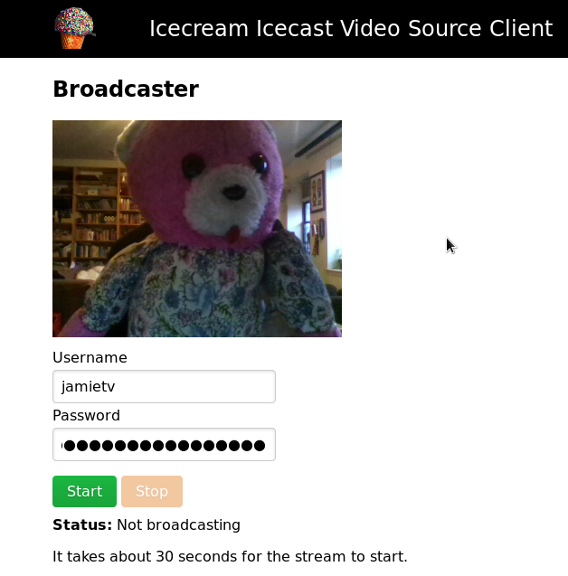

# Icecast web source client

`icecream` is a web browser based icecast video source client allows you to stream audio and video from your web browser to an icecast server.

It is based on a simple nodejs component that runs on a server (which does not have to be the same server as your icecast server). The server must have ffmpeg installed.

## Installing and Running

Start with:

    npm install

Then, edit www/js/config.js.

Then, run with:

    npm start

And then connect via http://localhost:3000/ (replace localhost with any domain that points to an IP address in use on your device).

## Screen grab

## Proxy via Nginx

Here is a minimal sample configuration for nginx.

    upstream websocket{
      server localhost:3000;
    }

    map $http_upgrade $connection_upgrade {
      default Upgrade;
      '' close;
    }

    server {
      listen *:443;

      # Path used to send a video stream via web sockets.
      location /broadcast/stream {
        proxy_pass http://websocket;
        proxy_http_version 1.1;
        proxy_set_header Upgrade $http_upgrade;
        proxy_set_header Connection $connection_upgrade;
      }

      # Show the broadcast page. Used by broadcasters to setup their stream.
      location /broadcast/ {
        proxy_pass http://localhost:3000/broadcast.html;
      }

      # Watch a video being streamed.
      location /w/ {
        proxy_pass http://localhost:3000/watch.html;
      }

      # See the generic welcome page.
      location / {
        proxy_pass http://localhost:3000/index.html;
      }

    }

## Limitations

This only works with Firefox, tested on version 58.

## Credits 

Thanks https://github.com/Keyne for pointing me towards https://github.com/fbsamples/Canvas-Streaming-Example.
